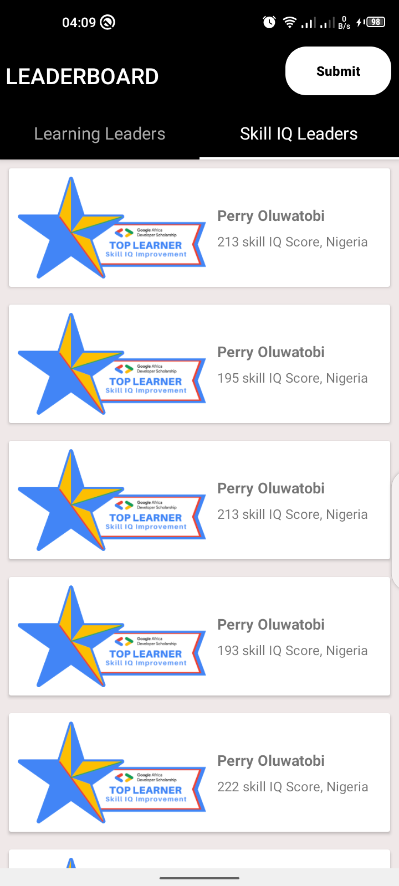

# AAD LeaderBoard Mobile APP 
This is a practice project that I developed. It consumes data from a GADS api. It displays top 20 Leaders both in total hours engaged with content and skill IQ
and present it in the android app. 
<b>The following are the resources used </b> 
1.Android Studio - Platform for android development 
2.Retrofit that helps in making API requests from my Application 
3.API 
4.Google Forms for submitting the project github repository 

- Below are the screenshots of the application  

    
   